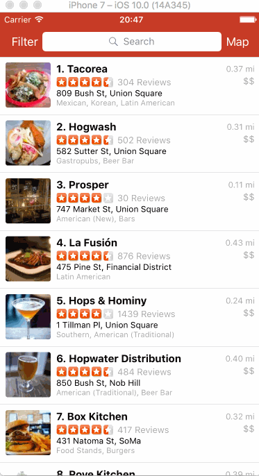

# Project 2 - Yelp

Yelp is a Yelp search app using the [Yelp API](http://www.yelp.com/developers/documentation/v2/search_api).

Time spent: 15 hours spent in total

## User Stories

The following **required** functionality is completed:

- [x] Search results page
    - [x] Table rows should be dynamic height according to the content height.
    - [x] Custom cells should have the proper Auto Layout constraints.
    - [x] Search bar should be in the navigation bar (doesn't have to expand to show location like the real Yelp app does).
- [x] Filter page. Unfortunately, not all the filters are supported in the Yelp API.
    - [x] The filters you should actually have are: category, sort (best match, distance, highest rated), distance, deals (on/off).
    - [x] The filters table should be organized into sections as in the mock.
    - [x] You can use the default UISwitch for on/off states.
    - [x] Clicking on the "Search" button should dismiss the filters page and trigger the search w/ the new filter settings.
    - [x] Display some of the available Yelp categories (choose any 3-4 that you want).

The following **optional** features are implemented:

- [x] Search results page
    - [x] Infinite scroll for restaurant results.
    - [x] Implement map view of restaurant results.
- [x] Filter page
    - [ ] Implement a custom switch instead of the default UISwitch.
    - [x] Distance filter should expand as in the real Yelp app
    - [x] Categories should show a subset of the full list with a "See All" row to expand. Category list is [here](http://www.yelp.com/developers/documentation/category_list).
    - [ ] Implement the restaurant detail page.

The following **additional** features are implemented:

- [x] Search results page
    - [x] User sees loading state while waiting for the API.
    - [x] User can pull to refresh to remove all filters and see the full list again
    - [x] Index displayed with business name to check easily businesses order, as in Yelp App
- [x] Navigation bar, icons, status bar, search and filter pages customized with similar Yelp colors

Please list two areas of the assignment you'd like to **discuss further with your peers** during the next class (examples include better ways to implement something, how to extend your app in certain ways, etc):

1. Expandable sections in table view
2. Different ways of organizing the data

## Video Walkthrough

Here's a walkthrough of implemented user stories:

GIF created with [LiceCap](http://www.cockos.com/licecap/).

## Notes

This version works in Portrait and Landscape orientation.

Icons by http://iconmonstr.com/

Used libraries (using CocoaPods):
[AFNetworking](https://github.com/AFNetworking/AFNetworking) - A delightful networking framework for iOS, OS X, watchOS, and tvOS. 
[MBProgressHUD](https://github.com/matej/MBProgressHUD) - MBProgressHUD, an iOS activity indicator view
[BDBOAuth1Manager](https://github.com/bdbergeron/BDBOAuth1Manager) - OAuth 1.0a library for AFNetworking 2.x

When initializing static array of dictionaries like:
static let categories:[String:String] = [["name" : "Afghan", "code": "afghani"],
                                         ["name" : "African", "code": "african"],
                                         ["name" : "American, New", "code": "newamerican"], (etc)]
the xcode didn't compile and stayed 'indexing', started working after changing to:
static func restaurantsCategoriesOptions() -> [[String:String]] {
var categories = [["name" : "Afghan", "code": "afghani"]]
categories.append(["name" : "African", "code": "african"])
categories.append(["name" : "American, New", "code": "newamerican"])

Deleting Derived Data folder and restarting the xcode and laptop didn't work.
(Reference: http://stackoverflow.com/questions/26494082/swift-xcode-index-freezing-or-slow)

## License

Copyright 2016 Alejandra Negrete

Licensed under the Apache License, Version 2.0 (the "License");
you may not use this file except in compliance with the License.
You may obtain a copy of the License at

http://www.apache.org/licenses/LICENSE-2.0

Unless required by applicable law or agreed to in writing, software
distributed under the License is distributed on an "AS IS" BASIS,
WITHOUT WARRANTIES OR CONDITIONS OF ANY KIND, either express or implied.
See the License for the specific language governing permissions and
limitations under the License.
